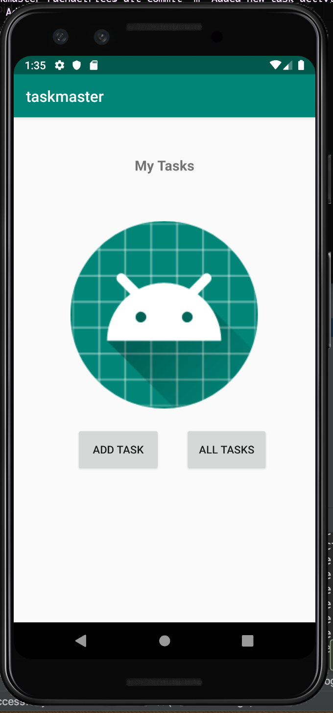
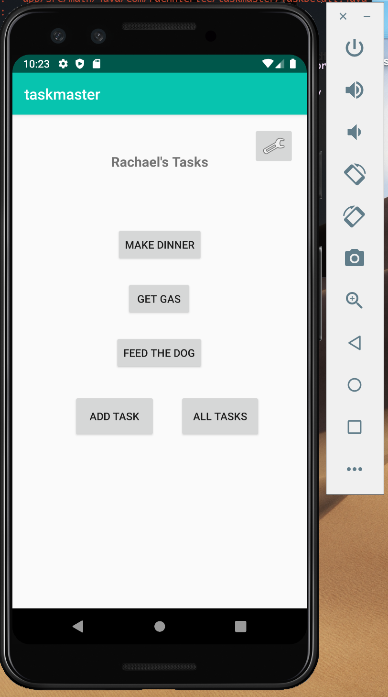
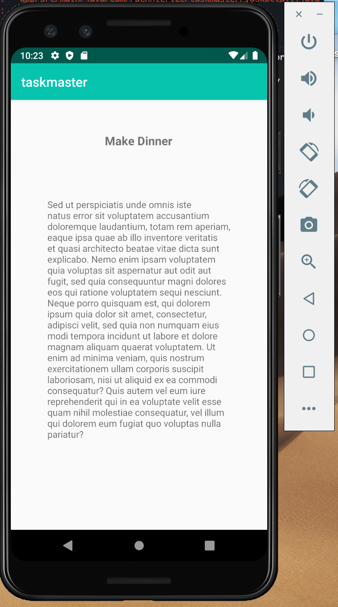
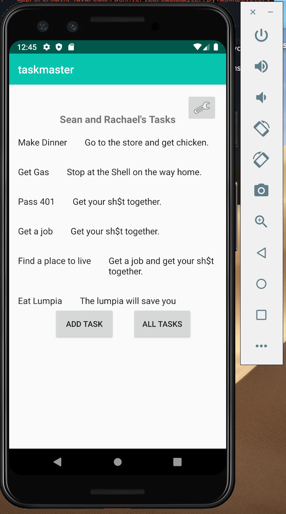
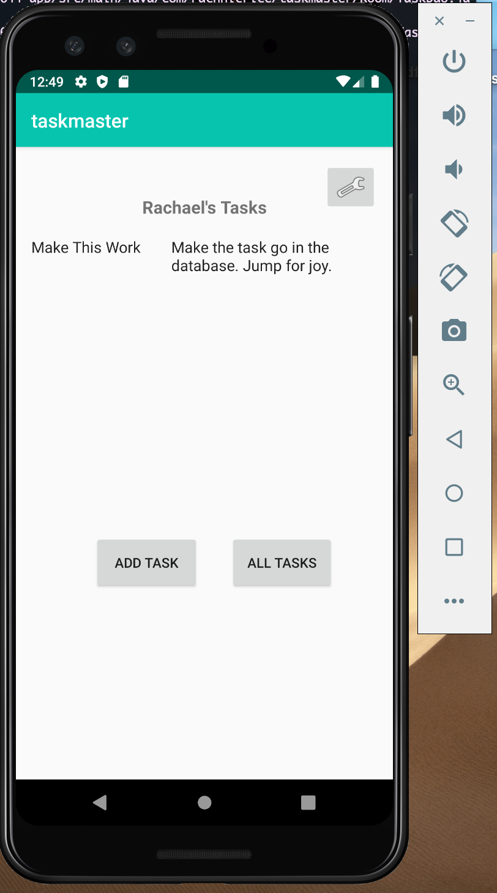
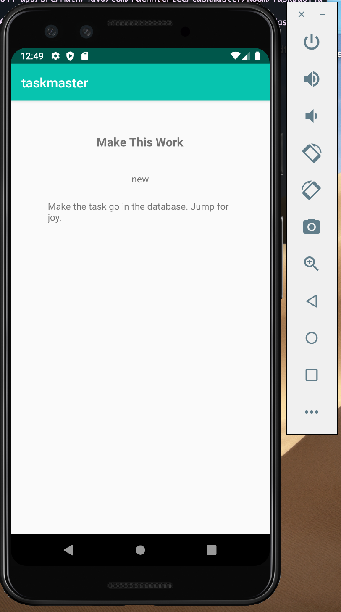
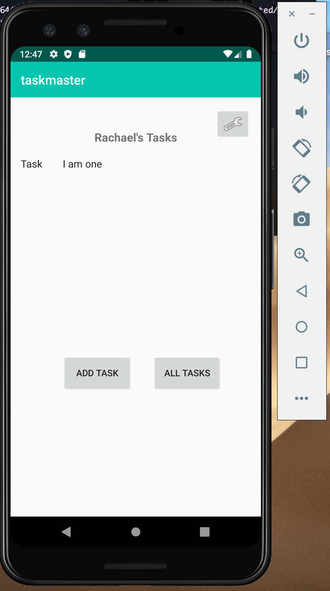

# taskmaster

Task Master is the app that will turn you into the Master of your Tasks. With it you can add and view tasks! So much fun.

### Updated the app on 02-11-2020
Added a home page, add task activity and all tasks activity. 

### Updated the app on 02-12-2020
Updated the home page to inculde a settings button and buttons for individual tasks. Added a task detail activity which will show the task title. Added a settings activity which will allow the user to save a username, and update the title of the homepage activity.

### Updated the app on 02-13-2020
Updated the home page to use a fragment which implements a recycler view. When tasks on the homepage are clicked the adaptor now handles the work of passing on the intent and information to the task detail activity.

### Updated the app on 02-19-2020
Updated the home page to display tasks from the database. Added room to the app and created DAO and database, implemented @Entity on the Task. Users can now add a task and it will be saved to the database. (Though tasks are only displaying on app restart?).

### Updated the app on 02-20-2020
Updated the app to connect to an AWS database using Amplify. Add task will now add to the DynamoDB database. Tasks rendered on the front page are all pulled from the Amplify database.

### Updated the app on 02-25-2020
Updated the app to add cognito. User's can now log in and log out of the app as well as create an account.

### Updated the app on 02-26-2020
Updated the app to add S3.

### Updated the app on 02-27-2020
Added an upload image button and event listener to the add task page. Added an image view to the task detail page.

